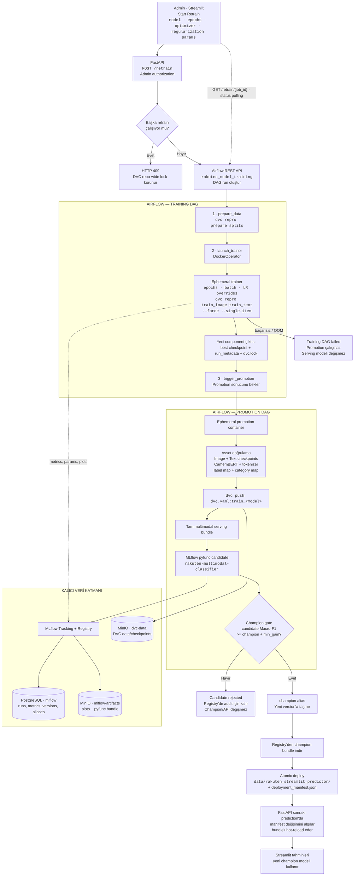

# Retrain sonrası mimari akış

Bu diyagram, Streamlit'teki **Start Retrain** butonuna basıldıktan sonra gerçekleşen gerçek uygulama akışını gösterir.

## Kritik ayrımlar

- Eğitim run'ı MLflow'a metrik ve grafik yazar; bu tek başına modeli production yapmaz.
- `dvc push`, seçilen component checkpoint'ini `dvc-data` remote'una arşivler; champion seçmez.
- Promotion her iki component'i, tokenizer'ı ve mapping dosyalarını tek bundle içinde Registry'ye candidate olarak kaydeder.
- Candidate gate'i geçemezse Registry version audit için kalır; mevcut `champion` ve serving dizini değişmez.
- Gate geçerse `champion` alias yeni version'a taşınır, bundle Registry'den tekrar indirilir ve serving dizini atomik olarak değiştirilir.
- FastAPI `deployment_manifest.json` içindeki version/run değişimini sonraki tahmin isteğinde algılayarak modeli yeniden yükler; API container restart gerekmez.
